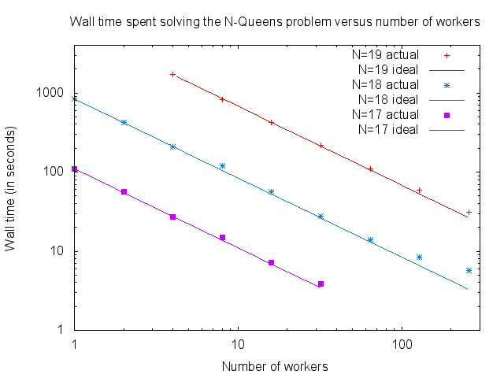

What is LogicGrowsOnTrees?
==========================

LogicGrowsOnTrees is a library that lets you use a standard Haskell domain
specific language (`MonadPlus` and friends) to write logic programs (by which we
mean programs that make non-deterministic choices and have guards to enforce
constraints) that you can run in a distributed setting.


Could you say that again in Haskellese?
=======================================

LogicGrowsOnTrees provides a logic programming monad designed for distributed
computing;  specifically, it takes a logic program (written using `MonadPlus`),
represents it as a (lazily generated) tree, and then explores the tree in
parallel.


What do you mean by "distributed"?
==================================

By "distributed" I mean parallelization that does not required shared memory but
only some form of communication. In particular there is package that is sibling
to this on that provides an *adapter* for MPI, which gives you immediate access
to large numbers of nodes on most supercomputers. In fact, the following is the
result of a scaling experiment to see how well the time needed to solve the
N-Queens problem for N=17, N=18, and N=19 on a local cluster:



The above was obtained by running a job three times for each number of workers
and problem size and then taking the best of three (*); the maximum number of
workers for this experiment was limited by the size of the cluster.

(*) The other two data points for each value of N were usually within a small
percentage of the other two points, save for (oddly) the *left*-most data point
(i.e., the one with the fewest number of workers) for each problem size, which
varied from 150%-200% of the best time; the full data set is available in the
`scaling/` directory.


When would I want to use this package?
======================================

This package is useful when you have a large space that can be defined
efficiently using a logic program that you want to explore to satisfy some goal,
such as finding all elements, counting the number of elements, finding just one
or a few elements, etc.

LogicGrowsOnTrees is particularly useful when your solution space has a lot of
structure as it gives you full control over the non-deterministic choices that
are made, which lets you avoid avoid making choices entirely that you know will
end in failure, as well as letting you factor out symmetries so that only one
solution is generated out of some equivalence class. For example, if
permutations result in equivalent solutions then you can factor out this symmetry
by only choosing later parts of a potential solution that are greater than
earlier parts of the solution.

What does a program written using this package look like?
=========================================================

The following is an example of a program that counts the number of solutions to
the n-queens problem for an input board size (which also given in
`examples/readme.hs`).  (NOTE:  I have optimized this code to be (hopefully)
easy to follow, rather than to be fast.)

```haskell
import Control.Applicative
import Control.Monad
import qualified Data.IntSet as IntSet
import System.Console.CmdTheLine

import LogicGrowsOnTrees
import LogicGrowsOnTrees.Parallel.Main
import LogicGrowsOnTrees.Parallel.Adapter.Threads
import LogicGrowsOnTrees.Utils.Word_
import LogicGrowsOnTrees.Utils.WordSum

-- Code that counts all the solutions for a given input board size.
nqueensCount 0 = error "board size must be positive"
nqueensCount n =
    -- Start with...
    go n -- ...n queens left...
       0 -- ... at row zero...
       -- ... with all columns available ...
       (IntSet.fromDistinctAscList [0..fromIntegral n-1])
       IntSet.empty -- ... with no occupied negative diagonals...
       IntSet.empty -- ... with no occupied positive diagonals.
  where
    -- We have placed the last queen, so this is a solution!
    go 0 _ _ _ _ = return (WordSum 1)

    -- We are still placing queens.
    go n
       row
       available_columns
       occupied_negative_diagonals
       occupied_positive_diagonals
     = do
        -- Pick one of the available columns.
        column <- allFrom $ IntSet.toList available_columns

        -- See if this spot conflicts with another queen on the negative diagonal.
        let negative_diagonal = row + column
        guard $ IntSet.notMember negative_diagonal occupied_negative_diagonals

        -- See if this spot conflicts with another queen on the positive diagonal.
        let positive_diagonal = row - column
        guard $ IntSet.notMember positive_diagonal occupied_positive_diagonals

        -- This spot is good!  Place a queen here and move on to the next row.
        go (n-1)
           (row+1)
           (IntSet.delete column available_columns)
           (IntSet.insert negative_diagonal occupied_negative_diagonals)
           (IntSet.insert positive_diagonal occupied_positive_diagonals)

main =
    -- Explore the tree generated (implicitly) by nqueensCount in parallel.
    mainForExploreTree
        -- Use threads for parallelism.
        driver

        -- Use a single positional required command-line argument to get the board size.
        (getWord
         <$>
         (required
          $
          pos 0
            Nothing
            posInfo
              { posName = "BOARD_SIZE"
              , posDoc = "board size"
              }
         )
        )

        -- Information about the program (for the help screen).
        (defTI { termDoc = "count the number of n-queens solutions for a given board size" })

        -- Function that processes the result of the run.
        (\n (RunOutcome _ termination_reason) -> do
            case termination_reason of
                Aborted _ -> error "search aborted"
                Completed (WordSum count) -> putStrLn $
                    "for a size " ++ show n ++ " board, found " ++ show count ++ " solutions"
                Failure _ message -> error $ "error: " ++ message
        )

        -- The logic program that generates the tree to explore.
        nqueensCount
```

The code above compiles to a program that takes a positional argument specifying
the size of the board and a `-n` argument used to specify the number of threads.
You can use `-c` to have the program create a checkpoint file on a regular basis
and `-i` to set how often the checkpoint is made (defaults to once per minute);
if the program starts up and sees the checkpoint file then it automatically
resumes from it.  To find out more about the available options, use `--help`
which provides an automatically generated help screen.

The above uses threads for parallelism, which means that you have to compile it
using the `--threaded` option. If you want to use processes instead of threads
(which could be more efficient as this does not require the additional overhead
incurred by the threaded runtime), then install `LogicGrowsOnTrees-processes`
and replace `Threads` with `Processes` in the import at the 8th line. If you
want workers to run on different machines then install
`LogicGrowsOnTrees-processes` and replace `Threads` with `Network`. If you have
access to a cluster with a large number of nodes, you will want to install
`LogicGrowsOnTrees-MPI` and replace `Threads` with `MPI`.

Where can I learn more?
=======================

Read [TUTORIAL.md](TUTORIAL.md) for a tutorial of how to write and run logic
programs using this package, [USERS_GUIDE.md](USERS_GUIDE.md) for a more
detailed explanation of how things work, and the haddock documentation available
at http://hackage.haskell.org/package/LogicGrowsOnTrees.

What platforms does it support:
===============================

The following packages have been tested on Linux, OSX, and Windows using the
latest Haskell Platform (2013.2.0.0):

* `LogicGrowsOnTrees` (+ Threads adapter);

* `LogicGrowsOnTrees-processors`; and

* `LogicGrowsOnTrees-network`.

`LogicGrowsOnTrees-MPI` has been tested as working on Linux and OSX using
[OpenMPI](http://www.open-mpi.org/), and since it only uses very basic
functionality (just sending, probing, and receiving messages) it should work on
any MPI implementation.

(I wasn't able to try Microsoft's MPI implementation because it only let me
install the 64-bit version (as my test machine was 64-bit) but Haskell on
Windows is only 32-bit.)


Why would I use this instead of Cloud Haskell?
==============================================

This package is higher level than Cloud Haskell in that it takes care of all the
work of parallelizing your logic program for you. In fact, if one wished one
could potentially write an *adapter* for LogicGrowsOnTrees that lets one use
Cloud Haskell as the communication layer.


Why would I use this instead of MapReduce?
==========================================

MapReduce and LogicGrowsOnTrees can both be viewed (in a *very* rough sense) as
mapping a function over a large data set and then performing a reduction on it.
The primary difference between them is that MapReduce is optimized for the case
where you have a huge data set that already exists (which means in particular
that optimizing I/O operations is a big deal), whereas LogicGrowsOnTrees is
optimized for the case where your data set needs to be generated on the fly
using a (possibly quite expensive) operation that involves making many
non-deterministic choices some of which lead to dead-ends (that produce no
results). Having said that, LogicGrowsOnTrees can also be used like MapReduce by
having your function generate data by reading it from files or possibly from a
database.


Why would I use this instead of a SAT/SMT/CLP/etc. solver?
==========================================================

First, it should be mentioned that one could use LogicGrowsOnTrees to
implement these solvers. That is, a solver could be written that uses the
`mplus` function whenever it needs to make a non-derministic choices (e.g. when
guessing whether a boolean variable should be true or false) and `mzero` to
indicate failure (e.g., when it has become clear that a particular set of
choices cannot result in a valid solution), and then the solver gets to use the
parallelization framework of this package for free! (For an example of such a
solver, see the [incremental-sat-solver
package](http://hackage.haskell.org/packages/archive/incremental-sat-solver/0.1.7/doc/html/Data-Boolean-SatSolver.html)
(which was not written by me).)

Having said that, if your problem can most easily and efficiently be expressed
as an input to a specialized solver, then this package might not be as useful to
you. *However*, even in this case you *might* still want to consider using this
package if there are constraints that you cannot express easily or efficiently
using one of the specialized solvers because this package gives you complete
control over how choices are made which means that you can, for example, enforce
a constraint by only making choices that are guaranteed to satisfy it, rather
than generating choices that may or may not satisfy it and then having to
perform an additional step to filter out all the ones that don't satisfy the
constraint.


Why Haskell?
============

Haskell has many strengths that made it ideal for this project:

1. Laziness

    Haskell has lazy (*) evaluation which means that it does not evaluate
    anything until the value is required to make progress; this capability means
    that ordinary functions can act as control structures. In particular, when
    you use `mplus a b` to signal a non-derministic choice, neither `a` nor `b`
    will be evaluated unless one chooses to explore respectively the left and/or
    right branch of the corresponding decision tree. This is very powerful
    because it allows us to explore the decision tree of a logic program as much
    or as little as we want and only have to pay for the parts that we choose to
    explore.

    (*) Technically Haskell is "non-strict" rather than "lazy", which means
    there might be times in practice when it evaluates something more than is
    strictly needed.


2. Purity

    Haskell is a pure language, which means that functions have no (observable)
    side-effects other than returning a value (*); in particular, this implies
    that all operations on data must be immutable which means that they result
    in a new value (that may reference parts or even all of the old value)
    rather than modifying the old value. This is an incredibly boon because it
    means that when we backtrack up to explore another branch of the decision
    tree we do not have to perform an undo operation to restore the old values
    from the new values because the old values were never lost! All that you
    have to do is "forget" about the new values and you are done. Furthermore,
    most data structures in Haskell are designed to have efficient immutable
    operations which try to re-use as much of an old value as possible in order
    to minimize the amount of copying needed to construct the new value.

    (Having said all of this, although it is strongly recommended that your
    logic program be pure by making it have type `Tree` as this will cause the
    type system to enforce purity, you can add various kinds of side-effects by
    using type `TreeT` instead; an example of a time when it might make sense to
    do this is if there is a data set that will be constant over the run which
    is large enough that you want to read it in from various files or a database
    as you need it. In general if you use side-effects then they need to be
    non-observable, which means that they are not affected by in which order the
    tree is explored or whether particular parts of the tree are explored more
    than once.)

    (*) Side-effects are implemented by, roughly speaking, having some types
    represent actions that cause side-effects when executed.

3. Powerful static type system

    When writing a very complicated program you want as much help as possible in
    making it correct, and Haskell's powerful type system helps you a lot here
    by harnessing the power of static analysis to ensure that all of the parts
    fit together correctly and to enforce invariants that you have encoded in
    the type system.


I have more questions!
======================

Then please contact the author (Gregory Crosswhite) at gcrosswhite@gmail.com! :-)
